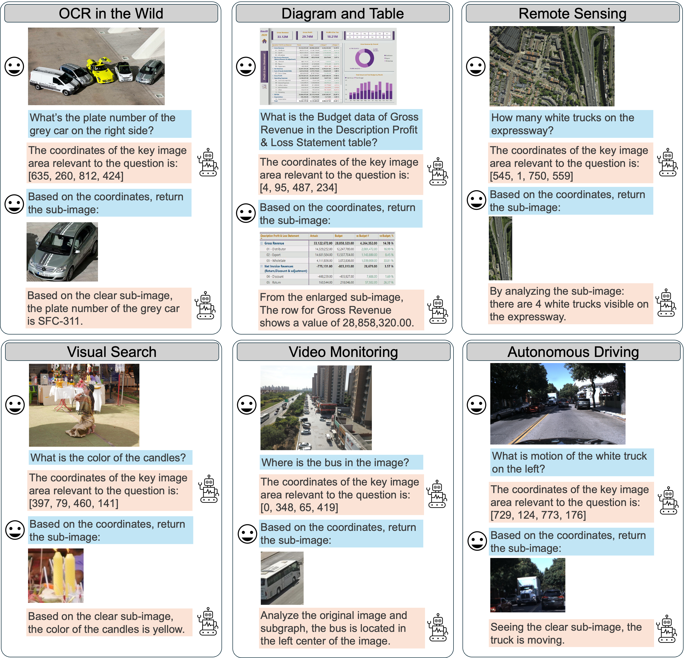
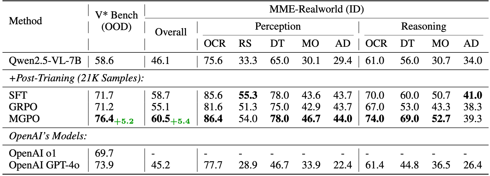

# High-Resolution Visual Reasoning via Multi-Turn Grounding-Based Reinforcement Learning

[](https://www.lmms-lab.com/posts/highres_visual_reasoning)

<!-- Authors: [Xinyu Huang](https://xinyu1205.github.io/), [Yuhao Dong](https://scholar.google.com/citations?user=kMui170AAAAJ&hl=zh-CN), Wei Li, Jinming Wu, Zihao Deng, [Bo Li](https://brianboli.com/), Zejun Ma -->


## Introduction

Inspired by the human visual system's top-down, task-driven search, we propose **Multi-turn Grounding-based Policy Optimization (MGPO)**. MGPO equips LMMs with interpretable, iterative visual grounding: the model predicts key regions, crops sub-images, and reasons over both the original and focused views.

**Key advantages:**
- **Interpretable, Top-down Visual Reasoning:** MGPO highlights which image regions are attended to at each step.
- **Breaks Pixel Limits:** Even if the full image is blurry due to resizing, MGPO identifies and crops clear sub-images for further analysis.
- **No Extra Grounding Annotations Needed:** MGPO is trained only with binary answer correctness, yet learns robust grounding.


---

## Experiments

### Visualizations
<p align="center">
  
</p>

<p align="center">
  (Examples of models trained with multi-turn grounding-based RL on high-resolution realworld tasks. The model first identifies key regions, which are then automatically cropped and returned as sub-images. Notably, despite only a binary reward function derived from the correctness of the final answer, the model gradually emerge robust grounding capability throughout the RL process.)
</p>


### Main Results

- **MGPO outperforms both SFT and GRPO** on high-resolution tasks.
- **+5.4%** on MME-Realworld (ID), **+5.2%** on V* Bench (OOD) over GRPO baseline.
- Surpasses OpenAI’s o1 and GPT-4o on V* Bench, despite using a smaller model and less data.

<p align="center">
  
</p>


## Training Code

Our code is based on verl, training code and script are available at 

https://github.com/xinyu1205/verl/blob/mgpo/examples/grpo_trainer/run_qwen2_5_vl-7b_mgpo.sh


## Citation
If you find our work to be useful for your research, please consider citing.

```bibtex
@article{huang2025highres,
  title={High-Resolution Visual Reasoning via Multi-Turn Grounding-Based Reinforcement Learning},
  author={Huang, Xinyu and Dong, Yuhao and Li, Wei and Wu, Jinming and Deng, Zihao and Li, Bo and Ma, Zejun},
  url={https://github.com/EvolvingLMMs-Lab/MGPO},
  year={2025}
}
```